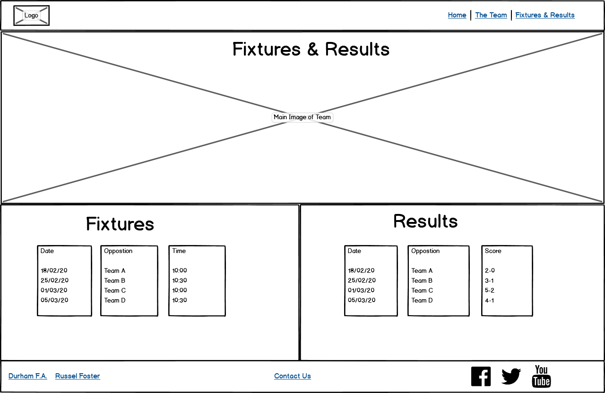
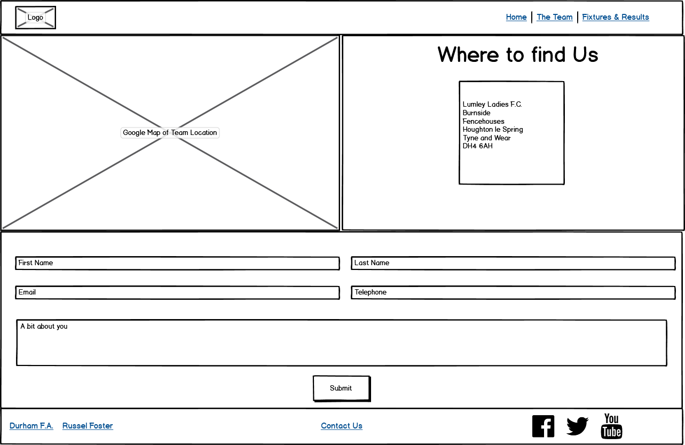
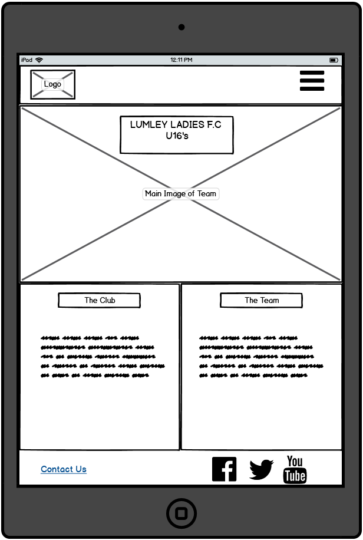
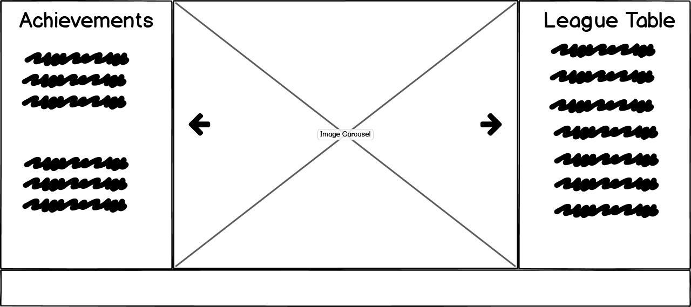

# _**Lumley Ladies Under 16’s**_ 

This website was designed for my daughters football team the Lumley Ladies under 16’s. Currently there is nowhere for people to go to find out information about the team, such as the latest fixtures and results or league table, or even where the team play.
I designed the website with this in mind, it’s somewhere that players, supporters, friends and family and also people new to the team can come and find out how the team are doing and get a little bit of information on each of the players. There is also a contact form to enable people to contact us with any questions, or tell us a bit about themselves if they want to join the team. 

## _**UX**_

I designed the website with a mobile first approach, I wanted it to be easy to navigate and have a similar structure to each page, so users feel a familiarity with each page they are viewing. The colours were chosen as I feel they work well with the club colours of Red, Black and White.

### _**Target Audience**_

The website is aimed at but not limited to the following users :

* Supporters of the team
* Supporters of the club
* The players
* Parents of the players
* Friends and family
* People interested in joining the team

### _**User Stories**_

As a supporter of the team/friends and family, I want to be able to see the upcoming fixtures, so that I can plan to watch them.

As a supporter of the team/friends and family, I want to see a league table, so that I can see how well the team is doing.

As a supporter of the team, I want to get more information on each individual player, so I can get to know them better.

As someone who is interested in joining the team, I want to be able to send my details to the coach, so they can contact me to discuss joining.

As someone who wants to watch the team for the first time, I want to see the location of where the team play, to enable me to plan my trip. 

As a user of the website, I want the pages to be visually appealing and easy to use, so I can navigate easily between the different sections.

## _**Wireframes**_

### _**Home Page**_

  

### _**Team Page**_

Having seperate tables on both the team page and the fixtures and results page was a design choice, as I felt it looked better that way and was also more responsive when viewed on smaller devices.

  

### _**Fixtures Page**_

  

### _**Contact Page**_

  

### _**Mobile View**_

  

### _**Tablet View**_

  

### _**Image Carousel**_

The image carousel and achievements and league table section were added at a later date and as such were not included in the initial wire frame. 

  

## _**Features**_

* Navigation Bar - This allows users to easily navigate the site, it is easy to use and is consistent throughout the website.
* Footer Links - These allow users to link to the clubs social media pages, there are also links to the Russel Foster league and the Durham F.A websites. Again these are consistent on each page.
* Image Carousel - Displays some images of the team in action
* Team Page - There are clickable popovers on every players name. This allows users to get a little bit more information on all of the players.
* Contact Form - Allows users to submit their details to us, this could be with any queries they have, or to let us know if they’re interested in joining the team.
* Embedded Google Map - Allows users to see where the team play and get directions.
* Fixtures and Results - Users can see the upcoming fixtures and get a list of the past few results.
* League Table - Users can get an understanding of how well the team are doing.

### _**Features left to implement**_

* Individual player images in the popovers on the team page.
* Fixtures and results to be self replicating, i.e to pull data from the leage website.
* League table to also pull data from the league website and update.
* Have a clickable link on each result with a link to a match report.
* Create a separate private page for the coach and the players to share information.

## _**Technologies Used**_

[HTML](https://en.wikipedia.org/wiki/HTML5) - HTML provides the content and structure for my website

[CSS](https://en.wikipedia.org/wiki/Cascading_Style_Sheets) - CSS provides the styling.

[Bootstrap](https://getbootstrap.com/) - The Bootstrap framework was used to create the layout for all of the pages. I also used it for the navbar, image carousel, popovers and tables.

[Google Fonts](https://fonts.google.com/) - I used the Roboto and Oswald fonts on each of my pages.

[Font Awesome](https://fontawesome.com/) - I uses the font awesome icons to style the links in the footer.

[jQuery](https://jquery.com/) - jQuery was used within Bootstrap to create the popover on the players names.

## _**Testing**_

A lot of the testing was carried out using the developer tools in Google Chrome, whilst in a preview from Gitpod. This was to look at the responsiveness of the website and to make sure it works well on mobile devices. This resulted in a lot of modifying on the go as I was creating the code.

**I tested the website on the following browsers using a Microsoft Surface Pro on Windows 10 pro.**

Google Chrome - Version 81.0.4044.122 (Official Build) (64-bit)

Microsoft Edge - 44.18362.449.0

Firefox - 75.0 (64 bit)

The website worked well on all of these browsers. All navigation links worked, the social links in the footer worked. All of the reuired elements in the contact form worked correctly as did the popovers on the players names. 

**I also tested the website on a number of devices as listed below.**

Google Pixel 3 xl using Google Chrome on Android 10

Moto E5 using using Google Chrome on Android 8.1

IPAD 6th Generation using Safari on IOS 13.4

Iphone 8 using Safari on IOS 13.4

The following websites were used for validation of my code.

HTML validation <https://validator.w3.org/>

CSS validation <https://jigsaw.w3.org/css-validator/> 

### _**Issues found in testing**_

1. The text on the homepage overflowed from the container when viewed on smaller devices. The font size was reduced slightly and this resolved this issue
2. The popover on the player “Sophie Luke” jumped to the player “Sophie Winlow” . This was due to them both having the same name, this was resolved by changing the name in the HREF for Sophie Luke to “sophiel”
3. Main image cut off most of the faces in the bottom row. This was resolved by increasing the height of the image.
4. Could not get social links to justify to either end of their containers. Resolved by a google search and adding the class of justify-content-end-start to the parent container.

### _**Not yet resolved**_

1. On smaller devices the last Icon for the social links jumps to another line. I have added a media query to reduce the icon size down to 0.6em at a max-width of 422px. But feel if I reduce the size down any further for smaller devices, it will be very difficult to see
2. The League table overflows it’s container on the homepage when viewed on tablet devices. I have given the table a class of “table-responsive”. This gets rid of the white space however it results in being able to drag the table from side to side.
