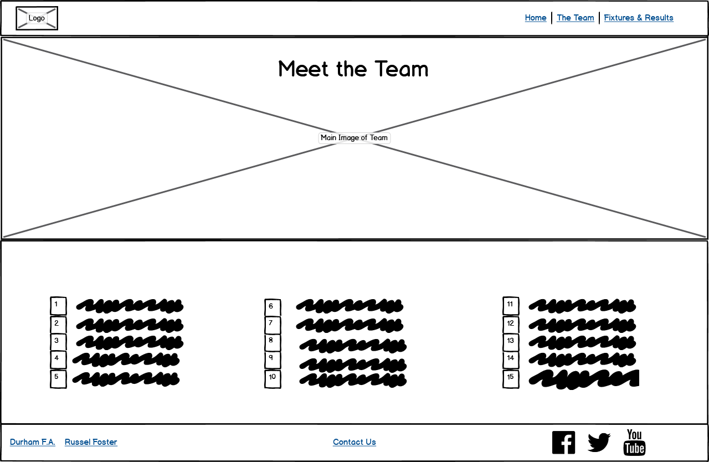
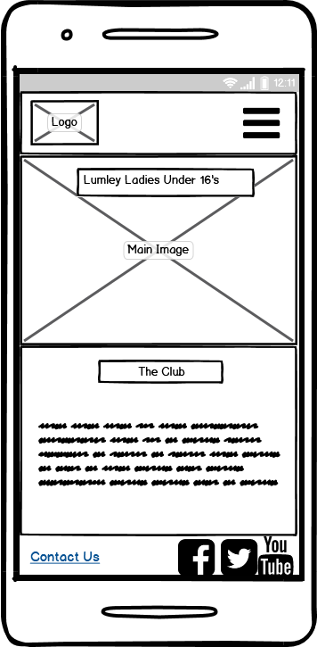
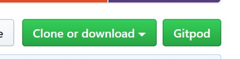

# _**Lumley Ladies Under 16’s**_ 

This website was designed for my daughters football team the Lumley Ladies under 16’s. Currently there is nowhere for people to go to find out information about the team, such as the latest fixtures and results or league table, or even where the team play.
I designed the website with this in mind, it is somewhere that players, supporters, friends and family and also people new to the team can come and find out how the team is performing and get a little bit of information on each of the players. There is also a contact form to enable people to contact us with any questions, or tell us a bit about themselves if they want to join the team. 

You can view the deployed website here - [Lumley Ladies Under 16's](https://adamparker75.github.io/Lumley-U16s/).

## _**UX**_

I designed the website with a mobile first approach, I wanted it to be easy to navigate and have a similar structure to each page, this is so that users feel a familiarity with each page they are viewing.   The colours were chosen as I feel they work well with the club colours of red, black and white.

### _**Target Audience**_

The website is aimed at but not limited to the following users :

* Supporters of the team.
* Supporters of the club.
* The players.
* Parents of the players.
* Friends and family.
* People interested in joining the team.

### _**User Stories**_

As a supporter of the team / friends and family, I want to be able to see the upcoming fixtures, so that I can plan to watch them.

As a supporter of the team / friends and family, I want to see a league table, so that I can see how well the team is performing.

As a supporter of the team, I want to get more information on each individual player, so I can get to know them better.

As someone who is interested in joining the team, I want to be able to send my details to the coach, so they can contact me to discuss joining.

As someone who wants to watch the team for the first time, I want to see the location of where the team play, to enable me to plan my trip. 

As a user of the website, I want the pages to be visually appealing and easy to use, so I can navigate easily between the different sections.

## _**Wireframes**_

### _**Home Page**_

  

### _**Team Page**_

Having separate tables on both the team page and the fixtures and results page was a design choice, as I felt it looked better that way and was also more responsive when viewed on smaller devices.

  

### _**Fixtures Page**_

  

### _**Contact Page**_

  

### _**Mobile View**_

  

### _**Tablet View**_

  

### _**Image Carousel**_

The image carousel, achievements and league table section were added at a later date and as such were not included in the initial wire frame. 

  

## _**Features**_

* **Navigation Bar** - This allows users to easily navigate the site, it is easy to use and is consistent throughout the website.
* **Footer Links** - These allow users to link to the clubs social media pages, there are also links to the Russel Foster league and the Durham F.A websites. Again these are consistent on each page.
* **Image Carousel** - Displays images of the team in action.
* **Team Page** - There are clickable popovers on every players name. This allows users to get a little information on all of the players.
* **Contact Form** - Allows users to submit their details to us, this could be with any queries they have, or to let us know if they’re interested in joining the team.
* **Embedded Google Map** - Allows users to see where the team play and get directions.
* **Fixtures and Results** - Users can see the upcoming fixtures and get a list of the past few results.
* **League Table** - Users can get an understanding of how well the team are doing.
* **Favicon** - Makes it easier for users to identify the site in their open tabs.

### _**Features left to implement**_

* Individual player images in the popovers on the team page.
* Fixtures and results to be self replicating, i.e to pull data from the league website.
* League table to also pull data from the league website and update.
* Have a clickable link on each result with a link to a match report.
* Create a separate private page for the coach and the players to share information.

## _**Technologies Used**_

[HTML](https://en.wikipedia.org/wiki/HTML5) - HTML provides the content and structure for my website

[CSS](https://en.wikipedia.org/wiki/Cascading_Style_Sheets) - CSS provides the styling.

[Bootstrap](https://getbootstrap.com/) - The Bootstrap framework was used to create the layout for all of the pages. I also used it for the navbar, image carousel, popovers and tables.

[Google Fonts](https://fonts.google.com/) - I used the Roboto and Oswald fonts on each of my pages.

[Font Awesome](https://fontawesome.com/) - I used the font awesome icons to style the links in the footer.

[jQuery](https://jquery.com/) - jQuery was used within Bootstrap to create the popover on the players names.

## _**Testing**_

A lot of the testing was carried out using the developer tools in Google Chrome, whilst in a preview from Gitpod. This was used to look at the responsiveness of the website and to make sure it works well on mobile devices. This resulted in a lot of modification on the go, as I was creating the code.

### _**User Story Tests**_

1. **Fixtures page**  
i. Click on the Fixtures and Results link in the navigation bar.  
ii. Does the Fixtures and Results page open?  
iii. Can the fixtures and results be displayed clearly?  

**All tests performed and no errors found.**

2. **League Table**  
i. Open the home page.   
ii. Scroll down to the League Table Section.  
iii. Can the League Table be viewed clearly? 

**All tests performed and no errors found.**

3. **Player Information**  
i. Click on the Team Page link in the navigation bar.  
ii. Are the names displayed clearly?  
iii. Click on a players name.  
iv. Does a popover appear with the players name and some information about the player?  
v. Click away from the players name.  
vi. Does the popover disappear?  
vii. Click on another players name.  
viii. Is the information displayed in the popover different?  
ix. Click on all the players names to ensure the correct information is displayed.  

**All tests performed and no errors found.**

4. **Contact Form**  
i. Click on the contact us link in the footer.  
ii. Click back to home and click on the contact link in the navigation bar.  
iii. Submit a blank form to check if an error message appears for the required field.  
iv. Test the email field with an invalid email address. Can the form be submitted?  
v. Place 5 characters in the text box and submit, do you get a message about the minimum number of characters?  
vi. Submit the form with all fields filled out correctly, can the form be submitted?  

**All tests performed and no errors found.**

5. **Google Map**  
i. Click on the contact us link in the footer.  
ii. Click back to home and click on the contact link in the navigation bar.  
iii. Is the embedded Google Map displayed?  
iv. Does the map zoom in and out?  
v. Does the view larger map link open the map in Google Maps?

**All tests performed and no errors found.**

**I tested the website on the following browsers using a Microsoft Surface Pro on Windows 10 pro.**

Google Chrome - Version 81.0.4044.122 (Official Build) (64-bit)

Microsoft Edge - 44.18362.449.0

Firefox - 75.0 (64 bit)

The website worked well on all of these browsers. All navigation links worked, the social links in the footer worked. All of the required elements in the contact form worked correctly as did the popovers on the players names. 

**I also tested the website on a number of devices as listed below.**

Google Pixel 3 xl using Google Chrome on Android 10

Moto E5 using using Google Chrome on Android 8.1

Ipad 6th Generation using Safari on IOS 13.4

Iphone 8 using Safari on IOS 13.4

The following websites were used for validation of my code.

[HTML validation](https://validator.w3.org/)

[CSS validation](https://jigsaw.w3.org/css-validator/) 

### _**Issues found in testing**_

1. The text on the homepage overflowed from the container when viewed on smaller devices. The font size was reduced slightly and this resolved this issue.
2. The popover on the player “Sophie Luke” jumped to the player “Sophie Winlow” . This was due to them both having the same id, this was resolved by changing the id in the HREF for Sophie Luke to “sophiel”
3. Main image cut off most of the faces in the bottom row. This was resolved by increasing the height of the image.
4. Could not get social links to justify to either end of their containers. Resolved by a google search and adding the class of justify-content-end-start to the parent container.

### _**Not yet resolved**_

1. ~~On smaller devices the last Icon for the social links jumps to another line. I have added a media query to reduce the icon size down to 0.6em at a max-width of 422px. But feel if I reduce the size down any further for smaller devices, it will be very difficult to see.~~   **This has now been resolved by removing the margin in the footer links.**

2. ~~The League table overflows it’s container on the homepage when viewed on tablet devices. I have given the table a class of “table-responsive”. This gets rid of the white space however it results in being able to drag the table from side to side.~~   **This has now been resolved by adding the bootstrap "order" class to the columns, making the league table and achievements section appear on the row below on medium devices.**

## _**Deployment**_

My website is hosted on GitHub Pages, to access the website please take the following steps.

### _**GitHub Pages**_

1. Navigate to my Github repository - <https://github.com/adamparker75/Lumley-U16s>
2. Click on the **settings** tab at the top of the page.
3. Scroll down to the **GitHub Pages** section.
4. Change the source to **master branch**.
5. After selecting master branch the page will refresh.
6. Scroll down to the GitHub Pages section and a green box saying **"your site is published at"** will appear.
7. Click the link to go to the published website.

 

  

You can view the deployed website here - [Lumley Ladies Under 16's](https://adamparker75.github.io/Lumley-U16s/)

### _**Git Clone**_

1. Navigate to my Github repository - <https://github.com/adamparker75/Lumley-U16s>
2. Click the green drop down that says clone or download.

 

  

3. To clone with HTTPS copy the URL in the box. <https://github.com/adamparker75/Lumley-U16s.git>
4. Open up your preferred IDE (Integrated Development Environment)
5. Change the directory to the location you want the clone to be made.
6. Type **git clone** and then paste the copied URL from step 3.
7. Press Enter and your local clone will be created.

## _**Credits**_

### _**Content**_

* The code for the navbar on all pages was copied from [w3schools](https://www.w3schools.com/bootstrap4/bootstrap_navbar.asp).
* The code for the image carousel on the homepage was copied from [w3schools](https://www.w3schools.com/bootstrap4/bootstrap_carousel.asp).
* The code for the popovers on the players names was copied from [w3schools](https://www.w3schools.com/bootstrap4/bootstrap_popover.asp).
* The code for the jQuery for the popover was copied from [w3schools](https://www.w3schools.com/bootstrap4/bootstrap_popover.asp).
* Background image on all pages was created with help from [stack overflow](https://stackoverflow.com/questions/50971782/using-background-image-with-bootstrap).
* The tables on all pages were designed with help from [getbootstrap](https://getbootstrap.com/docs/4.4/content/tables/).
* The contact page form was designed with help from [w3schools](https://www.w3schools.com/bootstrap4/bootstrap_forms.asp).
* The colours used on the website were chosen from [Adobe](https://color.adobe.com/create/color-wheel/).
* The wireframes were created with [Balsamiq](https://balsamiq.com/).
* The favicon was created on [favicon-generator](https://www.favicon-generator.org/) with assistance from peers in the Code Institute Slack community.

### _**Media**_

* The football team images were taken from the team [Facebook page](https://www.facebook.com/groups/725419510930537/).
* The Lumley FC logo was taken from the club [Facebook page](https://www.facebook.com/Lumley-Ladies-Football-Club-1152952134718930/).
* The Durham FA logo was taken from [google](https://www.google.com/search?q=durham+fa&source=lnms&tbm=isch&sa=X&ved=2ahUKEwjiz5XauIjpAhXklFwKHVbTAPUQ_AUoA3oECA4QBQ&biw=1500&bih=858).
* The Russel Foster League logo was taken from [google](https://www.google.com/search?q=russell+foster+league&tbm=isch&ved=2ahUKEwiNg-uGuYjpAhWP0-AKHdkVAoMQ2-cCegQIABAA&oq=russel+foster+&gs_lcp=CgNpbWcQARgAMgYIABAKEBgyBggAEAoQGDIGCAAQChAYMgYIABAKEBgyBggAEAoQGDIGCAAQChAYMgYIABAKEBgyBggAEAoQGDIGCAAQChAYUJRGWJRGYPBQaABwAHgAgAFQiAFQkgEBMZgBAKABAaoBC2d3cy13aXotaW1n&sclient=img&ei=V7qmXs37Io-ngwfZq4iYCA&bih=858&biw=1500).

### _**Acknowledgements**_

* To my wife **Claire Parker** for helping me test the website.
* To my mentor **Reuben Ferrante** for helping me through the process and providing advice and guidance.
* The inspiration for the page was taken from [start bootstrap](https://startbootstrap.com/previews/clean-blog/).