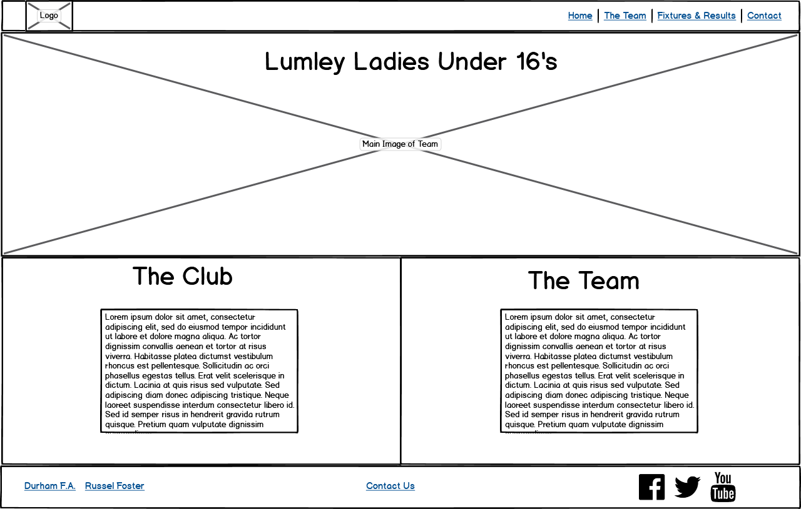

# _**Lumley Ladies Under 16’s**_ 

This website was designed for my daughters football team the Lumley Ladies under 16’s. Currently there is nowhere for people to go to find out information about the team, such as the latest fixtures and results or league table, or even where the team play.
I designed the website with this in mind, it’s somewhere that players, supporters, friends and family and also people new to the team can come and find out how the team are doing and get a little bit of information on each of the players. There is also a contact form to enable people to contact us with any questions, or tell us a bit about themselves if they want to join the team. 

## _**UX**_

I designed the website with a mobile first approach, I wanted it to be easy to navigate and have a similar structure to each page, so users feel a familiarity with each page they are viewing. The colours were chosen as I feel they work well with the club colours of Red, Black and White.

### _**Target Audience**_

The website is aimed at but not limited to the following users :

* Supporters of the team
* Supporters of the club
* The players
* Parents of the players
* Friends and family
* People interested in joining the team

### _**User Stories**_

As a supporter of the team/friends and family, I want to be able to see the upcoming fixtures, so that I can plan to watch them.

As a supporter of the team/friends and family, I want to see a league table, so that I can see how well the team is doing.

As a supporter of the team, I want to get more information on each individual player, so I can get to know them better.

As someone who is interested in joining the team, I want to be able to send my details to the coach, so they can contact me to discuss joining.

As someone who wants to watch the team for the first time, I want to see the location of where the team play, to enable me to plan my trip. 

As a user of the website, I want the pages to be visually appealing and easy to use, so I can navigate easily between the different sections.

## _**Wireframes**_

### _**Home Page**-

  

